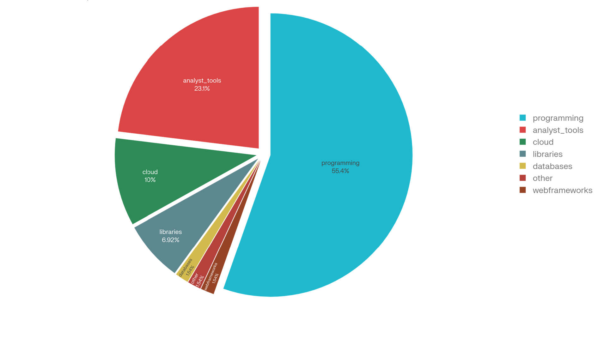
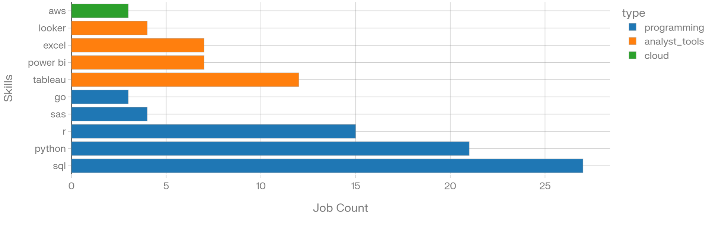
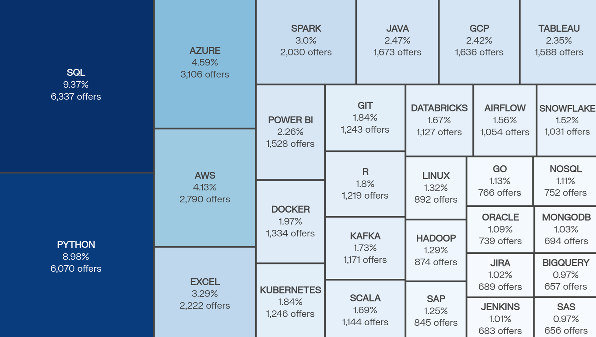
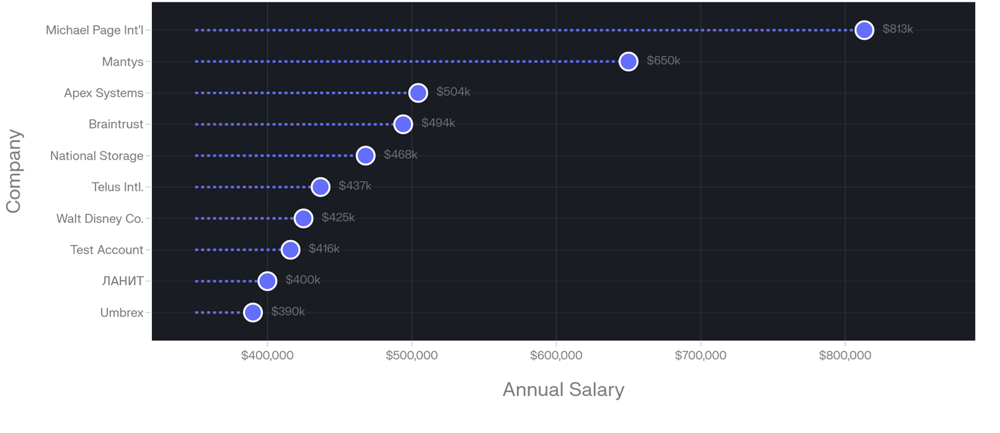

## 📊📊

I finished my beginner SQL course for Data Analytics. I learned core techniques like JOINs, CTEs, aggregations, CASE WHEN expressions, subqueries, and filtering with complex conditions.

This project explores real world job posting data to uncover insights about the Data Analytics job market. I defined the business questions, designed the queries to answer them, and analyzed the results.

**DATA:** [Google Drive](https://drive.google.com/drive/folders/1moeWYoUtUklJO6NJdWo9OV8zWjRn0rjN)

The questions I wanted to answer through my queries were :
1. Which Data Analytics skills are the most payed?
2. What are the most popular IT skills in Poland?
3. Which companies pay the most for Data Analytics?

**Tech Stack:**
-SQL, PostgreSQL, Visual Studio Code, Git & GitHub

# The Analysis
#### 1. Which Data Analytics skills are the most payed.
This query identifies the most in-demand skills among the **top 50 highest-paying Data Analyst job postings
It uses a CTE (`top_payed_jobs`) to normalize salaries — hourly rates are converted to years
using the standard 2080 working hours/year formula then aggregates skill counts
across matched postings.

```sql
WITH top_payed_jobs AS (
    SELECT 
        cd.name AS company_name,
        jof.job_id,
        jof.job_title,
        CASE 
            WHEN jof.salary_rate = 'hour' THEN  round(jof.salary_hour_avg * 2080,0)
            ELSE round(jof.salary_year_avg,0)
        END AS salary_year
    FROM job_postings_fact jof
    JOIN company_dim cd ON cd.company_id = jof.company_id
    WHERE (jof.salary_hour_avg IS NOT NULL 
        OR jof.salary_year_avg IS NOT NULL)
        AND jof.job_title_short ILIKE '%data analyst%'
    ORDER BY salary_year DESC
    LIMIT 50
)
SELECT 
    sd.skills,
    sd.type,
    COUNT(*) AS job_count,
    string_agg(tpj.company_name, ', ') as companies
FROM skills_dim sd
JOIN skills_job_dim sjd ON sjd.skill_id = sd.skill_id
JOIN top_payed_jobs tpj ON tpj.job_id = sjd.job_id
GROUP BY sd.skills, sd.type
ORDER BY job_count DESC;
```
| skills   | type          | job_count | companies                                             |
| -------- | ------------- | --------- | ----------------------------------------------------- |
| sql      | programming   | 27        | Apex Systems, Braintrust, TikTok, AT&T, Anthropic...  |
| python   | programming   | 21        | Care.com, TikTok, HCL America, Anthropic, Walmart...  |
| r        | programming   | 15        | TikTok, Torc Robotics, GradBay, Walmart, Genentech... |
| tableau  | analyst_tools | 12        | Michael Page, Illuminate, Care.com, Walmart, AT&T...  |
| power bi | analyst_tools | 7         | Braintrust, Torc Robotics, Michael Page, Walmart...   |


The most important Skill categories in top 50 Data Analyst jobs are programming 55,4%, analyst tools 23,1% and cloud 10%.


This chart shows the top skills required in highest paid companies. Analyst and programming dominate. In programming SQL and Python dominate, in analyst tools Tableau is the most common skill. 


#### 2. What are the most popular IT skills in Poland?
This query shows hich skills in IT are the most popular in Poland. It filters listings by location using (`ILIKE '%poland%'`), then aggregates skill counts and calculates each skill's percentage share of the total market
```sql
SELECT 
    sd.skills,
    COUNT(jof.job_id) AS count_job, ROUND((COUNT(jof.job_id)::FLOAT * 100/ sum(COUNT(jof.job_id)) OVER ())::NUMERIC, 2) AS percentage
FROM job_postings_fact jof
JOIN skills_job_dim sjd ON sjd.job_id = jof.job_id
JOIN skills_dim sd ON sd.skill_id = sjd.skill_id
WHERE jof.job_location ILIKE '%poland%'
GROUP BY sd.skills
ORDER BY count_job DESC;
```
| Skill     | Count  | Percentage |
|-----------|--------|------------|
| sql       | 6,337  | 9.37%      |
| python    | 6,070  | 8.98%      |
| azure     | 3,106  | 4.59%      |
| aws       | 2,790  | 4.13%      |
| excel     | 2,222  | 3.29%      |
| spark     | 2,030  | 3.00%      |
| java      | 1,673  | 2.47%      |


This chart shows which skills in IT are the most popular in Poland. SQL 9.37% and Python 8.98% dominate in job advertisements.

#### 3. Which companies pay the most for Data Analitics?
This query identifies the top 10 highest-paying Data Analyst job postings across all companies in the dataset.
It normalizes salaries by converting hourly rates to annual equivalents using the standard 2080 working hours/year formula (salary_hour_avg * 2080), falling back to salary_year_avg for salaried roles — ensuring a fair, apples-to-apples comparison across different pay structures.

```sql
SELECT 
    cd.name AS company_name,
    jof.job_title,
    jof.job_title_short,
    jof.job_location,
    CASE 
        WHEN jof.salary_rate = 'hour' THEN  round(jof.salary_hour_avg * 2080,0)
        ELSE round(jof.salary_year_avg,0)
    END AS salary_year
FROM job_postings_fact jof
JOIN company_dim cd on cd.company_id = jof.company_id
WHERE jof.salary_hour_avg IS NOT NULL 
     OR jof.salary_year_avg IS NOT NULL
     AND jof.job_title_short ILIKE '%data analyst%'
ORDER BY salary_year DESC
LIMIT 10;
```
| # | Company                        | Job Title                                               | Job Title Short | Location      | Salary/Year |
| - | ------------------------------ | ------------------------------------------------------- | --------------- | ------------- | ----------- |
| 1 | Michael Page International Inc | Global Budget Data Analyst                              | Data Analyst    | New York, NY  | $813,280    |
| 2 | Mantys                         | Data Analyst                                            | Data Analyst    | Anywhere      | $650,000    |
| 3 | Apex Systems                   | Data Analyst                                            | Data Analyst    | Sunnyvale, CA | $504,400    |
| 4 | Braintrust                     | Data Scientist (with Marketing Data Science experience) | Data Scientist  | N/A           | $494,000    |
| 5 | National Storage Affiliates    | Data Science for Revenue Management Advisor             | Data Scientist  | Anywhere      | $468,000    |


Michael Page International Inc based in New York offer the top $813,280/year. Which is $163,280 more than the second-highest offer, making it a clear outlier in the market. 

